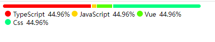

1. ### progress（多任务进度显示条）

   - 可以根据传入的数据来显示进度条。

   - 传参样式：

     ```tsx
     let obj = {
       TypeScript: 1215282,
       JavaScript: 61282,
       Vue: 211282,
       Css: 1215282,
     }
     interface obj{
         any:number
     }
     ```

   - 示例：

     

---

